# SSMA:  Self-Supervised Model Adaptation for Multimodal Semantic Segmentation
SSMA is a state-of-the-art deep learning fusion scheme for self-supervised multimodal semantic image segmentation, where the goal is to assign semantic labels (e.g., car, road, tree and so on) to every pixel in the input image. SSMA is easily trainable on a single GPU with 12 GB of memory and has a fast inference time. SSMA achieves state-of-the-art multimodal semantic segmentation performance on Cityscapes, Synthia, ScanNet, SUN RGB-D and Freiburg Forest datasets.

This repository contains our TensorFlow implementation of SSMA which allows you to train your own model on any dataset and evaluate the results in terms of the mean IoU metric. 

If you find the code useful for your research, please consider citing our paper:
```
@article{valada18SSMA,
  author = {Valada, Abhinav and Mohan, Rohit and Burgard, Wolfram},
  title = {Self-Supervised Model Adaptation for Multimodal Semantic Segmentation},
  journal = {arXiv preprint arXiv:1808.03833},
  month = {August},
  year = {2018},
}
```

## Live Demo
http://deepscene.cs.uni-freiburg.de

## Example Segmentation Results

| Dataset       | Modality1     |Modality2    | Segmented Image|
| ------------- | ------------- |-------------|-------------   |
| Cityscapes    |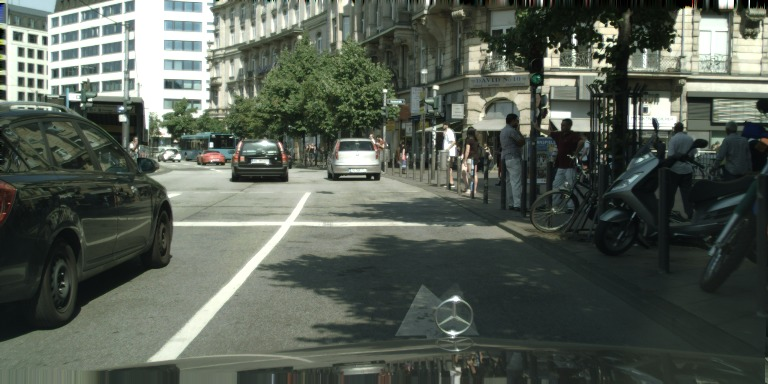 | 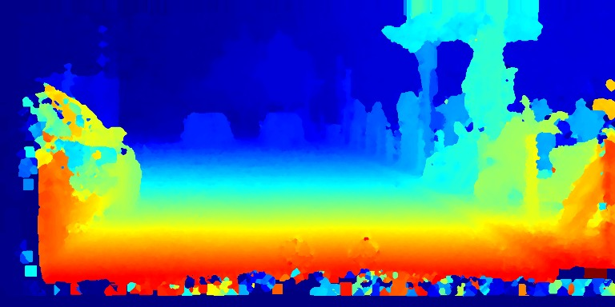 | 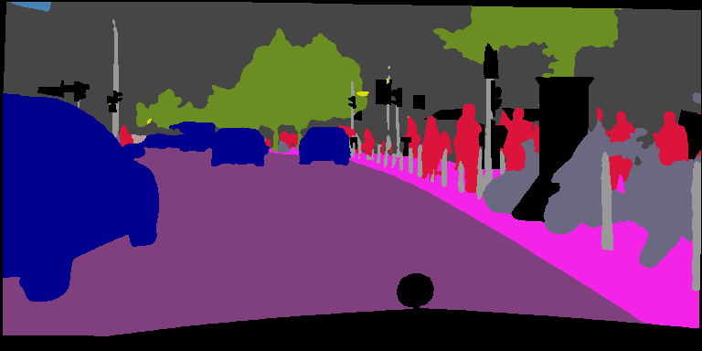|
| Forest  | 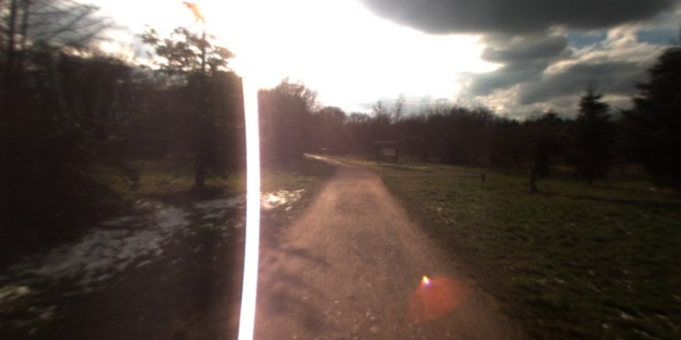  | 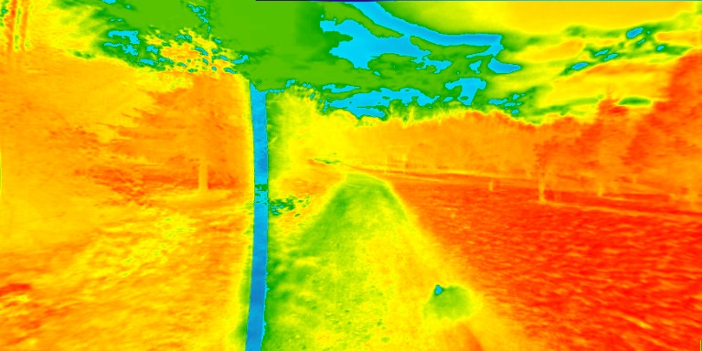  |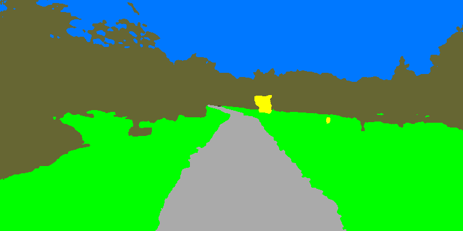 |
| Sun RGB-D  | 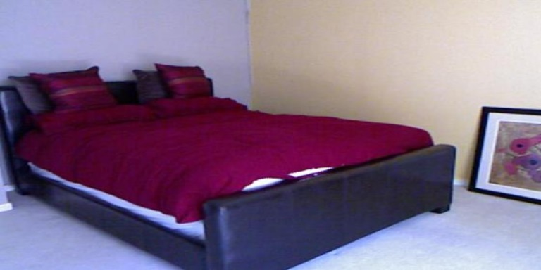  |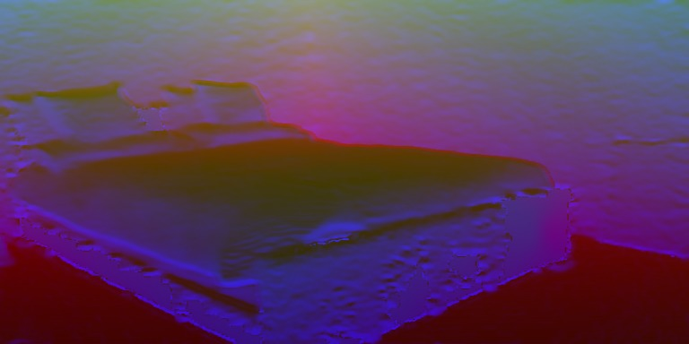  | 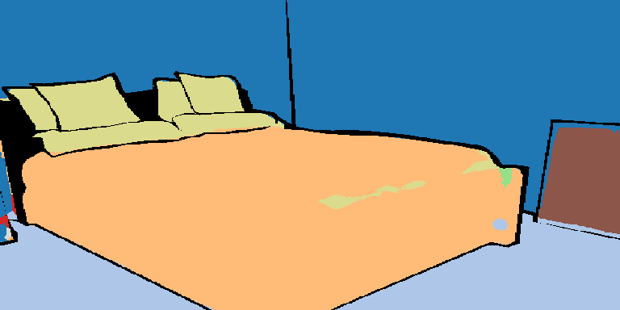|
| Synthia  | 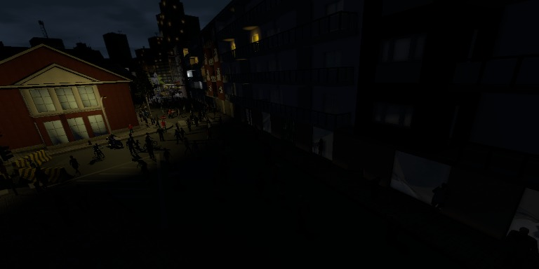  |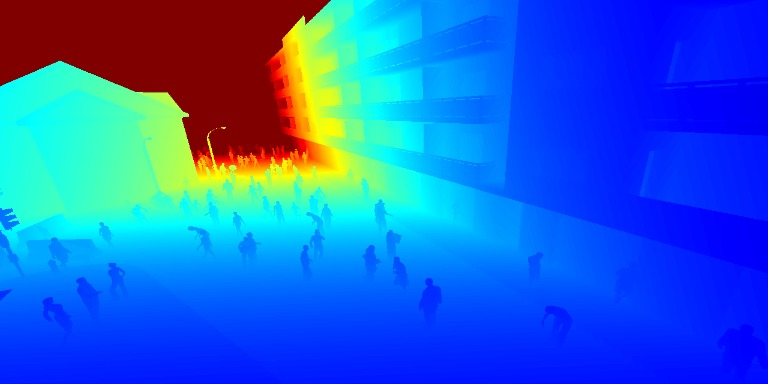  | 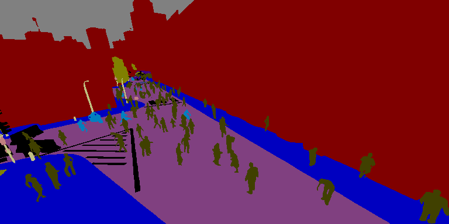 |
| ScanNet v2  | 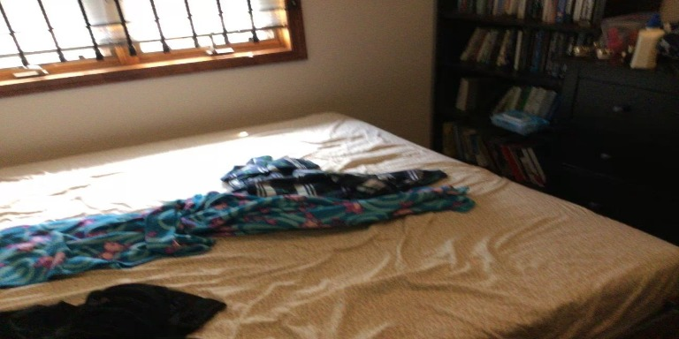  |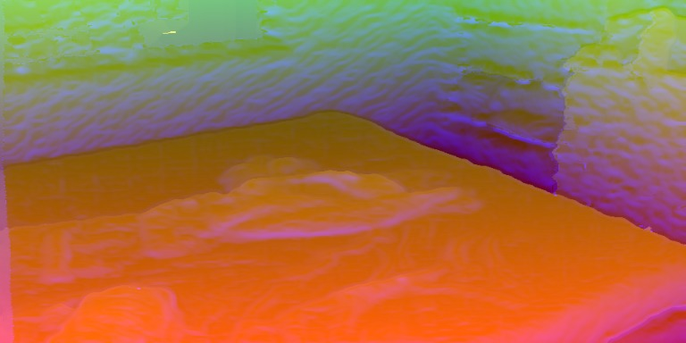  |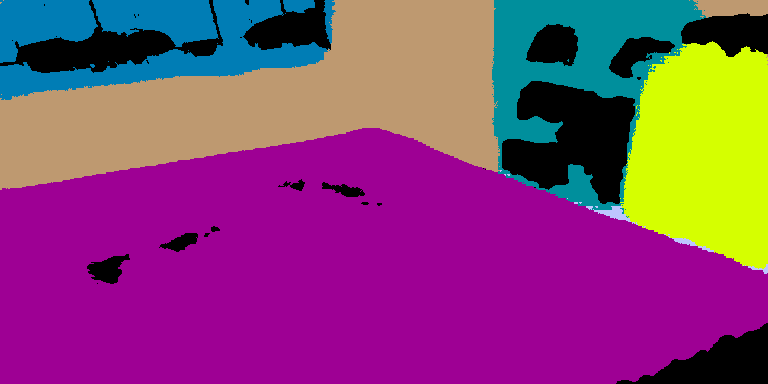 |

## Contacts
* [Abhinav Valada](http://www2.informatik.uni-freiburg.de/~valada/)
* [Rohit Mohan](https://github.com/mohan1914)

## System Requirements

#### Programming Language
```
Python 2.7
```

#### Python Packages
```
tensorflow-gpu 1.4.0
```

## Configure the Network

First train an individual [AdapNet++](https://github.com/DeepSceneSeg/AdapNet-pp) model for modality 1 and modality 2 in the dataset. We will use this pre-trained modality-secific models for initializing our SSMA network.

#### Data

* Augment the training data.
  In our work, we first resized the images in the dataset to 768x384 pixels and then apply a series of augmentations (random_flip, random_scale and random_crop). The image corresonding to each modality and the label should be augmented together using the same parameters.

* Convert the training data (augmented), test data and validation data into the .tfrecords format.
  Create a .txt file for each set having entries in the following format:
  ```
     path_to_modality1/0.png path_to_modality2/0.png path_to_label/0.png
     path_to_modality1/1.png path_to_modality2/1.png path_to_label/1.png
     path_to_modality1/2.png path_to_modality2/2.png path_to_label/2.png
     ...
  ```
 Run the convert_to_tfrecords.py from dataset folder for each of the train, test, val sets to create the tfrecords:
  ```
     python convert_to_tfrecords.py --file path_to_.txt_file --record tf_records_name 
  ```
  (Input to model is in BGR and 'NHWC' form)
 
#### Training Params
```
    gpu_id: id of gpu to be used
    model: name of the model
    num_classes: number of classes
    checkpoint1:  path to pre-trained model for modality 1 (rgb)
    checkpoint2:  path to pre-trained model for modality 2 (jet,hha,evi)
    checkpoint: path to save model
    train_data: path to dataset .tfrecords
    batch_size: training batch size
    skip_step: how many steps to print loss 
    height: height of input image
    width: width of input image
    max_iteration: how many iterations to train
    learning_rate: initial learning rate
    save_step: how many steps to save the model
    power: parameter for poly learning rate
```

#### Evaluation Params
```
    gpu_id: id of gpu to be used
    model: name of the model
    num_classes: number of classes
    checkpoint: path to saved model
    test_data: path to dataset .tfrecords
    batch_size: evaluation batch size
    skip_step: how many steps to print mIoU
    height: height of input image
    width: width of input image
```

#### Please refer our [paper](https://arxiv.org/pdf/1808.03833.pdf) for the dataset preparation procedure for each modality and the training protocol to be employed.
     
## Training and Evaluation

#### Training Procedure
Edit the config file for training in config folder.
Run:
```
python train.py -c config cityscapes_train.config or python train.py --config cityscapes_train.config
```

#### Evaluation Procedure

Select a checkpoint to test/validate your model in terms of the mean IoU.
Edit the config file for evaluation in config folder.
```
python evaluate.py -c config cityscapes_test.config or python evaluate.py --config cityscapes_test.config
```

## Additional Notes:
   * We provide SSMA fusion implementation for AdapNet++ as the expert network architecture. You can swap Adapnet++ with any network of your choice by modifying the models/ssma_helper.py script.
  * We only provide the single scale evaluation script. Multi-Scale+Flip evaluation further imporves the performance of the model.
   * The code in this repository only performs training on a single GPU. Multi-GPU training using synchronized batch normalization with larger batch size further improves the performance of the model.
   * Initializing the model with pre-trained weights from large datasets such as the Mapillary Vistas and BDD100K yields an improved performance.
   
## License
For academic usage, the code is released under the [GPLv3](https://www.gnu.org/licenses/gpl-3.0.en.html) license. For any commercial purpose, please contact the authors.
